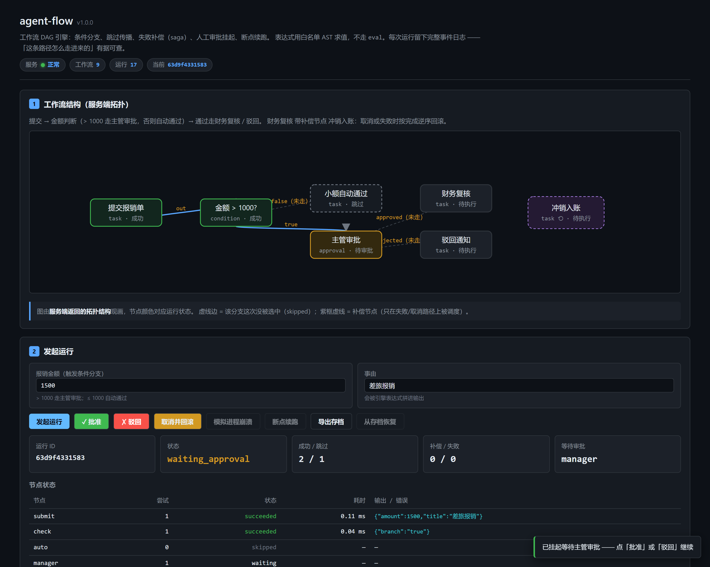

# agent-flow · 工作流 DAG 编排引擎

条件分支、跳过传播、失败补偿（saga）、人工审批挂起、断点续跑 —— 全部在一个
**同步、单线程、核心层零第三方依赖**的引擎里。

```
调度 / 状态机 / 白名单表达式   →  纯 Python 标准库
HTTP 层（FastAPI + pydantic）  →  唯一允许第三方依赖的模块（CI 门禁强制）
```



## 它解决什么问题

把「一堆函数调用」变成「工作流」的，不是 `for` 循环，而是这五件事：

| 能力 | 没有它会怎样 |
|---|---|
| **条件分支 + 跳过传播** | 没选中的分支照样执行；下游节点要么永远挂起、要么误判失败 |
| **补偿（saga）** | 失败/取消后已产生的副作用（扣款、发邮件）没人撤销 |
| **审批挂起** | 人工审批一挂几分钟到几天，进程重启、发版全发生在挂起期间 |
| **断点续跑** | 不能恢复的状态等于「审批之后从头再跑」，对不幂等的任务是事故 |
| **事件日志** | 「这条路径怎么走进来的」无据可查，排障全靠猜 |

## 核心设计决定（以及它们各自踩过的坑）

**1. skipped 是显式状态，不是"没执行"。**
条件分支没选中的下游必须被标记 skipped 并**递归传播**。判定规则：
下游的所有上游里有任意一个 succeeded → 正常执行；全部 skipped → 自己也 skipped。
本引擎第一版的真实 bug 就是两条分支都跑了 —— 由
`test_true_branch_runs_false_branch_skips` 抓出来。

**2. 补偿节点不进主调度循环。**
补偿节点从入口不可达（校验规则强制），于是入度为 0，而入度为 0 在调度器里的
含义是"这是入口节点，直接执行" —— 结果**一次成功的报销审批输出里出现了
「已冲销：差旅报销」**。现在：补偿只能由失败/取消路径调度，
且「补偿节点当入口」在注册时就被 422 拒绝。

**3. 审批挂起的节点状态是 `waiting`，不是 `running`。**
复用 running 会让监控把「等审批等了三天」显示成「执行了三天」，
而前者恰恰是审批流最该被看见的指标。

**4. 存档里还挂着审批时，续跑不许判定成功。**
崩溃恢复最容易撞上这个窗口：status 被置回 running 而 `pending_approval`
还在 —— 一路没活干就直接 `succeeded`，等于把一笔还没被批准的业务
标记成办完了。

**5. 补偿按完成的逆序执行。**
后完成的动作可能建立在先完成动作的状态上（先创建订单、再扣库存），
撤销必须先撤销后者。顺序补偿会试图撤销一个已经不存在的状态。

**6. 表达式是白名单 AST，不是 eval。**
节点参数几乎总是来自外部输入（API 请求体、配置文件）。白名单只放行
字面量 / 名字 / 四则与比较 / 与或非（**必须短路**）/ 三元 / dict 一层取属性。
函数调用、下标、推导式、导入、下划线开头的属性一律拒绝。
`false and <任何东西>` 不会求值右边 —— 这不是优化，是语义：
在工作流里，「条件没命中也执行了下游动作」等于事故。

**7. 崩溃模拟对应的是真实窗口。**
`POST /api/run/{id}/crash` 把**最后一个已完成的节点**退回 pending ——
它模拟的是「副作用已发生、完成标记没落盘、进程没了」。
续跑必然重跑这个节点（`attempts` 变成 2，这是"被重跑过"的证据），
所以工作流里的任务必须幂等。不幂等的任务在这个窗口里必然重复一次，
靠引擎救不回来，只能靠任务侧的去重键。

**8. 同步、单线程，是刻意的。**
需要吞吐量的是数据管道，不是审批流。一旦真并发，事件日志的顺序
就不再确定，排障成本指数级上升。

## 目录结构

```
app/
  dag.py        (264 行)  静态结构：校验（一次性报全部问题）、三色 DFS 找环、
                          Kahn 拓扑序（平局按 id 排序，结果可复现）、不可达检测
  state.py      (205 行)  运行状态、合法状态转移表、追加式事件日志、to_json/from_json
  safe_expr.py  (200 行)  白名单 AST 求值器，MAX_EXPR_LENGTH=512
  engine.py     (568 行)  调度主循环、分支、跳过传播、重试、补偿、审批、续跑、崩溃恢复
  main.py       (368 行)  FastAPI 路由（唯一允许第三方依赖的模块）
web/index.html  (390 行)  SVG DAG 可视化 + 事件时间线 + 全流程操作按钮
tests/          (866 行)  108 个单元测试
scripts/        (1216 行) 零依赖门禁 / 端到端验收 / 前端渲染验证
```

## 快速开始

```bash
pip install -r requirements.txt
uvicorn app.main:app --host 127.0.0.1 --port 8132
# 打开 http://127.0.0.1:8132
```

内置一个「报销审批」演示工作流（金额 > 1000 走主管审批，否则自动通过；
财务复核带补偿节点），打开页面即可跑通全部路径。

## API

| 方法 | 路径 | 说明 |
|---|---|---|
| GET | `/api/health` | 健康与计数 |
| GET | `/api/options` | 节点类型 / 状态全集 / 表达式语言说明 |
| POST/GET | `/api/workflow` | 注册 / 列出工作流定义（422 一次性带回全部校验问题） |
| POST | `/api/run` | 发起运行 |
| POST | `/api/run/{id}/approve` | 审批（`{"approved": bool, "comment": str}`） |
| POST | `/api/run/{id}/resume` | 断点续跑 |
| POST | `/api/run/{id}/cancel` | 取消并按逆序补偿 |
| POST | `/api/run/{id}/crash` | 模拟进程崩溃（制造「完成未落盘」窗口） |
| GET | `/api/run/{id}/archive` | 导出可序列化存档 |
| POST | `/api/run/restore` | 从存档恢复（跨进程续跑的载体） |

## 实测验收（本项目每一格数字都来自脚本输出，不是估计）

| 验收 | 结果 | 命令 |
|---|---|---|
| 单元测试 | **108 passed** (0.18s) | `pytest -q` |
| 端到端黑盒验收 | **141 通过 · 0 失败**（12 段） | `python scripts/e2e_check.py` |
| 前端渲染验证 | **68 通过 · 0 失败**，10 张截图，0 张重复 | `node scripts/shot_frontend.js` |
| 零依赖门禁 | 5 个核心模块零第三方依赖，1 个豁免理由成立 | `python scripts/check_core_isolation.py` |

**端到端覆盖的 12 段**：健康检查 / 元信息 / 内置工作流结构 / 小额自动通过
（false 分支 + 跳过传播）/ 审批挂起 → 批准 / 审批挂起 → 驳回 / 崩溃 → 续跑
（`attempts` 2）/ 取消并回滚（saga 逆序）/ 存档导出与恢复 / 非法定义与错误码
（404 / 422）/ 表达式沙箱（6 种逃逸全部被拒且短路生效）/ 前端页面可达。

**表达式沙箱实测**：`__import__('os').system(...)`、`open(...)`、下标、
`input.__class__`、推导式、lambda —— 全部在节点级失败（终态 failed），
不产生任何副作用；`false and 坏表达式` 返回 `false` 而不报错（短路）。

**门禁有效性实测**：向 `app/state.py` 注入 `import numpy` 后，
静态扫描定位到第 14 行，动态导入额外暴露了污染扩散到下游 `app.engine`
—— 退出码 1，CI 拦截生效。

## CI

`.github/workflows/ci.yml` 四个 job：

1. **test** — pytest 全量
2. **e2e** — 起真实 uvicorn 进程 → 端到端黑盒验收
3. **isolation** — 零依赖门禁
4. **docker** — 构建镜像并跑通 `/api/health`

## Docker

```bash
docker compose up --build
# http://127.0.0.1:8132
```

## 状态机

```
pending ──→ running ──→ succeeded
   │            │  │→ failed（终态）
   │            │  └→ waiting_approval ──→ running（批准/驳回后）
   └──→ cancelled   └→ cancelled
succeeded ──→ cancelled   ← 有意保留的唯一终态出口（取消并回滚 = saga 的意义）
```

非法转移（例如 succeeded → running）直接拒绝，错误信息里列出全部合法目标。

## License

MIT
